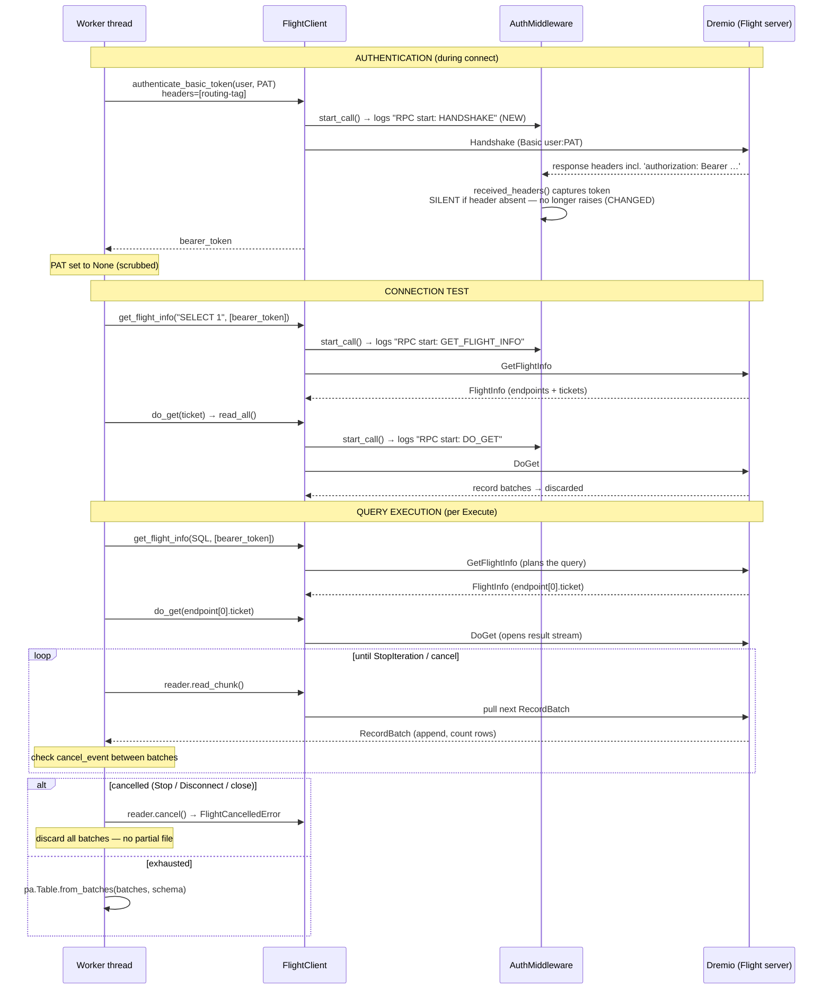

# Dremio to Excel — GUI data-flow diagrams

Reflects the desktop tool (`dremio_Tool/`) after the 2026-08-19 updates:
column ceiling, TLS fail-loud, auth-middleware silence + per-RPC status logging,
and the auto `.txt` session log. See `../../dremio_excel_skill/BUILD_LOG.md`
Steps 1/6/7 for the change record.

PNG renders sit beside this file: `gui_full_journey.png`, `gui_arrow_flight.png`.

---

## 1. Full journey: credentials → Dremio → Excel

```mermaid
flowchart TD
    subgraph SRC["Credential sources"]
        KR[("Windows Credential Manager<br/>keyring: DremioExporter/username")]
        CR[(".credentials<br/>base64 fallback")]
        CFG[("config.json<br/>host · port · user · log_retention_days")]
    end

    KR -.token.-> FORM
    CR -.token.-> FORM
    CFG -.host/user.-> FORM
    FORM["Connection form fields"] --> CN["_connect()<br/>validate_connection_params<br/>logs 'Connect requested'"]

    subgraph CONNECT["CONNECT (daemon thread: _connect_thread)"]
        CN --> DC["DremioConnection.connect()"]
        DC --> SSL{"use_tls?"}
        SSL -->|no| PLAIN["grpc+tcp (unencrypted)"]
        SSL -->|yes| CERT{"RWE CA found in<br/>Windows cert store?"}
        CERT -->|yes| VER["tls_root_certs = cert<br/>(server verified)"]
        CERT -->|no| WARN["disable_server_verification<br/>WARNING logged — encrypted<br/>but NOT verified (CHANGED)"]
        VER --> FC["build flight.FlightClient<br/>+ AuthMiddlewareFactory(on_status)"]
        WARN --> FC
        PLAIN --> FC
        FC --> AUTH["authenticate_basic_token(user, PAT)"]
        AUTH --> MW["middleware captures 'authorization'<br/>→ bearer_token<br/>(silent if absent — no longer raises)"]
        MW --> SCRUB["PAT scrubbed: token = None"]
        SCRUB --> TEST["_test_connection(): SELECT 1"]
    end

    TEST --> READY(["Connected · Execute enabled<br/>'Connection established in Xs'"])

    READY --> EX["_execute_and_export()<br/>resolve path · overwrite prompt<br/>snapshot settings · logs query"]

    subgraph EXEC["EXECUTE (daemon thread: _execute_thread)"]
        EX --> EQ["connection.execute_query(query, cancel_event)"]
        EQ --> FLIGHT[["Arrow Flight exchange<br/>(see sequence diagram)"]]
        FLIGHT --> TBL["pa.Table.from_batches(...)"]
        TBL --> A2P["_arrow_to_pandas()<br/>decimal128 → float64<br/>to_pandas()"]
        A2P --> DF[("pandas DataFrame")]
    end

    DF --> XL

    subgraph EXPORT["EXPORT (_export_to_excel)"]
        XL["openpyxl Workbook(write_only)"] --> ROWS{"rows > 1,048,575?"}
        ROWS -->|yes| REFUSE["Refuse before writing<br/>(row ceiling)"]
        ROWS -->|no| COLS{"cols > 16,384?"}
        COLS -->|yes| REFUSE2["Refuse before writing<br/>(column ceiling — NEW)"]
        COLS -->|no| LOOP["append loop, cell by cell"]
        LOOP --> SAN["sanitise illegal control chars"]
        LOOP --> TRUNC{"cell > 32,767 chars?"}
        TRUNC -->|yes| SIDE["write full values to<br/>&lt;name&gt;.truncated.txt sidecar"]
        SAN --> WRITE["atomic write:<br/>temp file → fsync → os.replace"]
        TRUNC --> WRITE
        WRITE --> XLSX[("export.xlsx")]
    end

    XLSX --> DONE(["Report warnings · success dialog<br/>open file (Windows)"])

    LOG[["Session .txt log + panel (NEW)<br/>%APPDATA%…/logs/dremio_log_*.txt<br/>middleware · RPC · timing"]]
    CN -.status.-> LOG
    EQ -.status.-> LOG
```

---

## 2. Zoom: the Arrow Flight process (client ↔ Dremio)

---

## What changed vs the original diagrams

| Change | Where |
|---|---|
| Column limit (`_check_column_ceiling`, 16,384) | EXPORT: new `cols > 16,384?` refuse branch |
| TLS fails loud on missing CA | CONNECT: `RWE CA found?` decision + WARNING branch |
| Auth middleware no longer raises on later RPCs | capture step in both diagrams |
| Per-RPC status logging | `start_call() → logs "RPC start: …"` in the sequence |
| Auto `.txt` session log + timing | `LOG` node + activity annotations |

Unchanged and verified still correct: `decimal128 → float64` (kept in the GUI),
the chunked `read_chunk()` loop with `cancel_event`, `reader.cancel()` discarding
all on cancel, the truncation sidecar, illegal-char sanitising, and the atomic
temp→fsync→replace write.
